<div align="center">

# 📚 BookStore System Analysis & Design
### A Comprehensive UML-Based Software Engineering Project


</div>

---

## 📖 Table of Contents
- [Project Overview](#project-overview)
- [System Objectives](#system-objectives)
- [System Architecture](#system-architecture)
- [Sequence Diagrams & Explanations](#sequence-diagrams)
- [My Contribution](#my-contribution)
- [Frontend Prototype](#frontend-prototype)
- [Repository Structure](#repository-structure)
- [Project Diagram Gallery](#gallery)

---

<a id="project-overview"></a>
## 📘 Project Overview

This repository hosts the **System Analysis and Design documentation** for an online **BookStore System**, accompanied by a **Frontend Prototype** that serves as a visual verification of availability and flow.

> **🎓 Academic Context**
> *   **Course:** System Analysis and Design
> *   **Goal:** To strictly model system behavior using **UML 2.5 standards**.
> *   **Scope:** The frontend is a *prototype* to demonstrate the user interface flow, while the core value lies in the architectural documentation.

<a id="system-objectives"></a>
### 🎯 System Objectives
*   **e-Commerce Core:** Browsing, Searching, Cart Management, and Checkout.
*   **Role Management:** Distinct workflows for *Guest*, *Customer*, *Admin*, and *Shipper*.
*   **Formal Modeling:** Rigorous use of Class, Sequence, Activity, and Use Case diagrams.

---

<a id="system-architecture"></a>
## 📊 System Architecture (UML Diagrams)

### 1. Structural Modeling
<div align="center">

| Class Diagram |
| :---: |
|  |
| *Defines system entities, attributes, and relationships.* |

</div>

### 2. Behavioral Modeling
The system interactions are defined by **7 key Sequence Diagrams**, illustrating the flow from User → Frontend → Backend → Database.

*   **Auth:** Login & Registration flows.
*   **Commerce:** Product selection to final Purchase.
*   **Admin:** Dashboard operations and content management.

### 3. Process Modeling
**Activity Charts** and **Data Flow Diagrams (DFD)** are included to map out the logical progression of tasks and data movement across the system.

---

<a id="sequence-diagrams"></a>
## 🧾 Sequence Diagrams – Detailed Descriptions

> [!IMPORTANT]
> **Full Documentation Available:**
> Detailed, step-by-step explanations for every Sequence Diagram (Transactions, Logic, Error Handling) are available in the **[Sequence Descriptions Folder](./sequence-descriptions/)**.

For a deeper dive into the logic, check the `sequence-descriptions/` folder.
Each markdown file there contains:
*   **Pre/Post Conditions**
*   **Actors Involved**
*   **Step-by-step Execution Flow**
*   **Alternative Paths & Error Handling**

---

<a id="frontend-prototype"></a>
## 💻 Frontend Prototype

A bilingual (**English / Arabic**) responsive frontend was built to visualize the requirements.

| English Interface | Arabic Interface |
| :---: | :---: |
| Home, Shop, Cart, Checkout | RTL Layout, Localized Content |

**Technologies:** `HTML5` • `CSS3` • `JavaScript`

---

<a id="my-contribution"></a>
## 👤 My Contribution

I was responsible for the **Behavioral Analysis** and **Documentation** phase:
1.  **Designed** all 7 Sequence Diagrams.
2.  **Authored** detailed use-case descriptions for every major interaction.
3.  **Ensured** consistency between the visual prototype and the theoretical models.

---

<a id="repository-structure"></a>
## 📂 Repository Structure

```
Diagrams/                → UML diagrams and system models
sequence-descriptions/   → Detailed sequence diagram explanations
HTML/                    → Frontend structure
CSS/                     → Styling files
```

---

<a id="conclusion"></a>
## ✅ Conclusion

This project provides a comprehensive UML-based analysis of an online BookStore system, focusing on system behavior, structure, and interaction flows.
It serves as a strong academic reference for **Software Engineering**, **System Analysis**, and **UML Design**.

> **Keywords:** UML 2.5, Sequence Diagrams, Use Case Analysis, System Analysis, Software Engineering, Web Systems

---

<a id="gallery"></a>
## 🎨 Project Diagram Gallery

<details>
<summary><strong>Click to expand Structural Diagrams</strong></summary>

### Class Structure

</details>

<details>
<summary><strong>Click to expand Behavioral Diagrams (Sequence)</strong></summary>

| ID | Diagram |
| :--- | :--- |
| **01** | 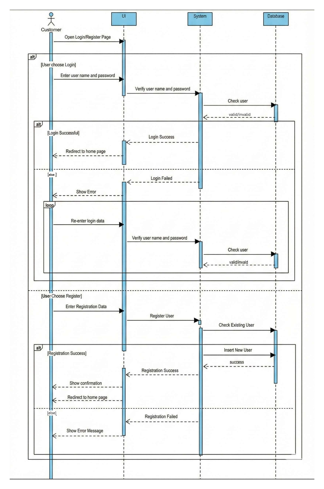 |
| **02** |  |
| **03** | 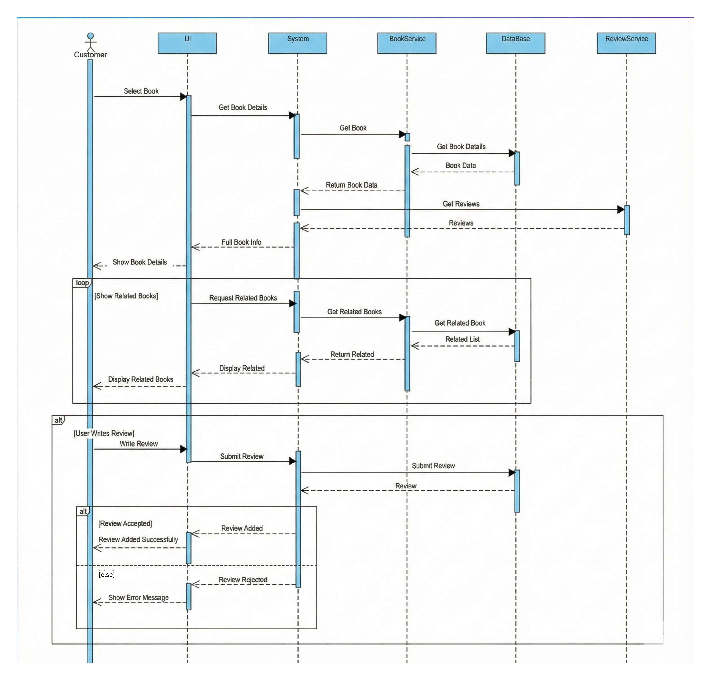 |
| **04** | 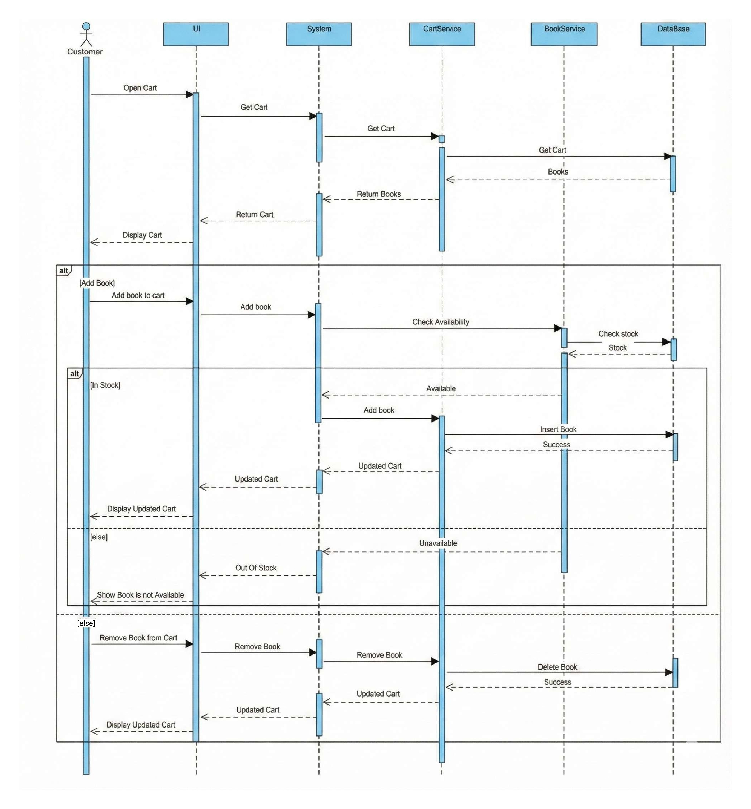 |
| **05** | 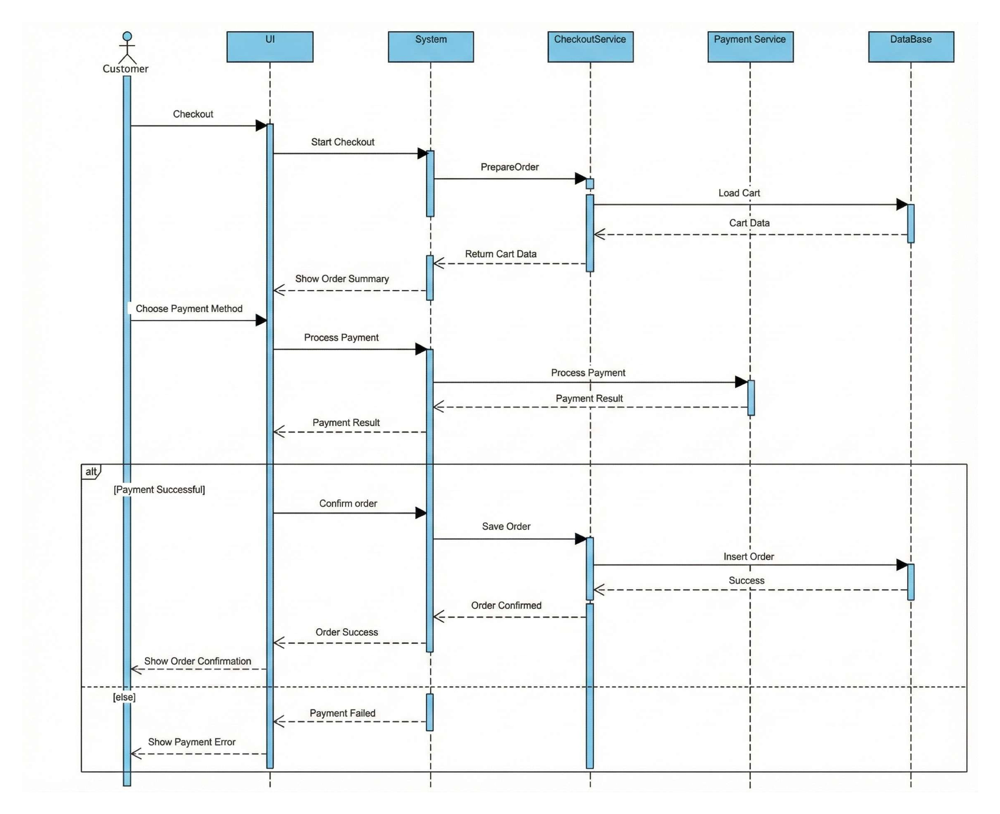 |
| **06** |  |
| **07** |  |

</details>

<details>
<summary><strong>Click to expand Activity Diagrams</strong></summary>

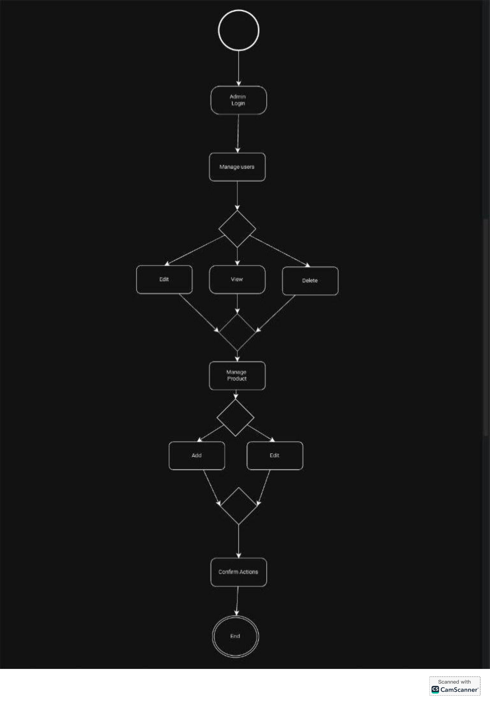

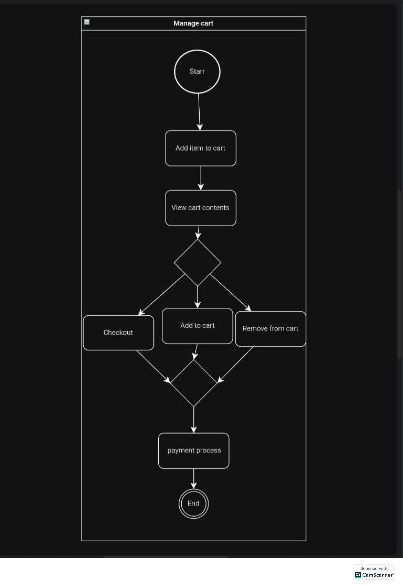


</details>

<details>
<summary><strong>Click to expand Use Case Diagrams</strong></summary>

### Main Overview


### Detailed Breakdown
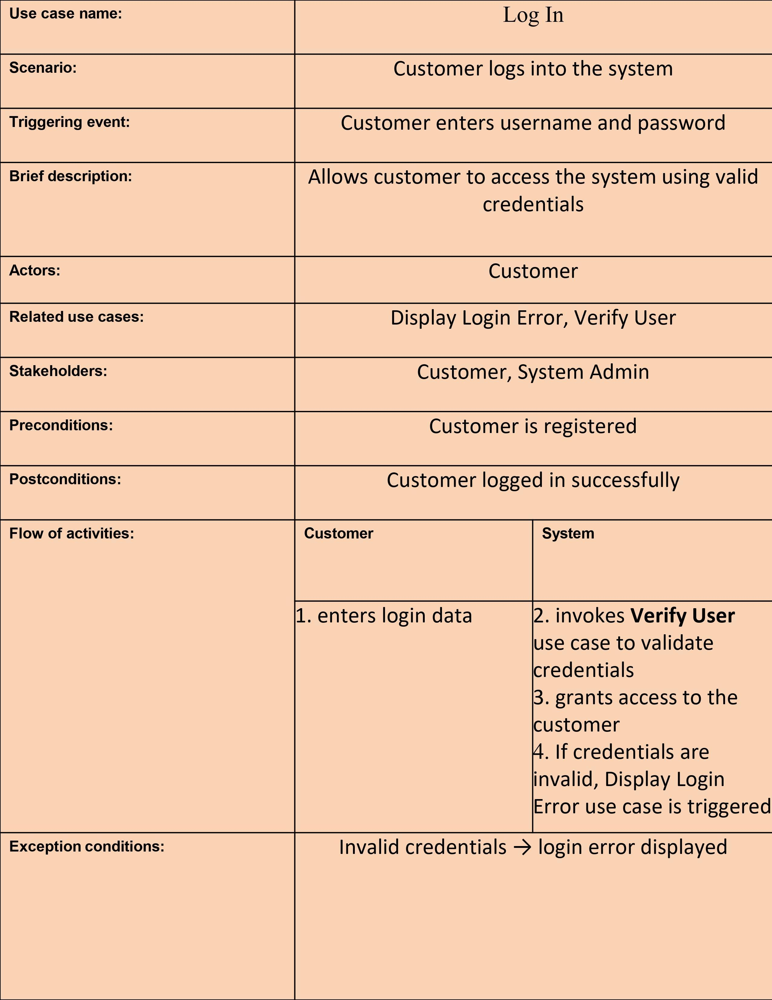
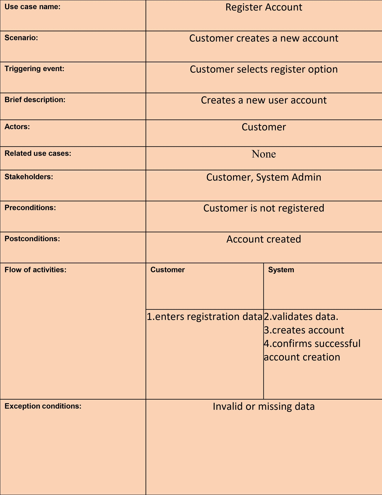


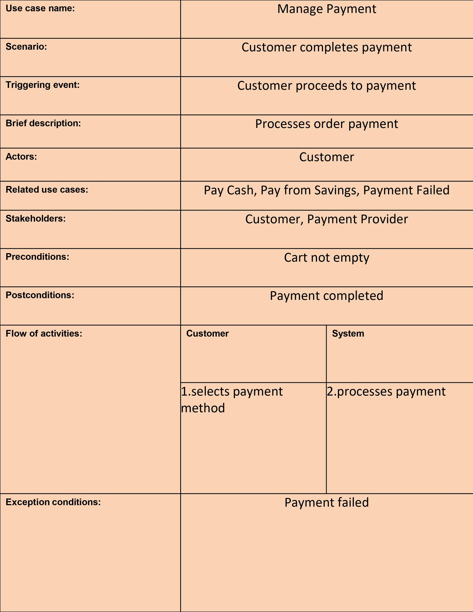

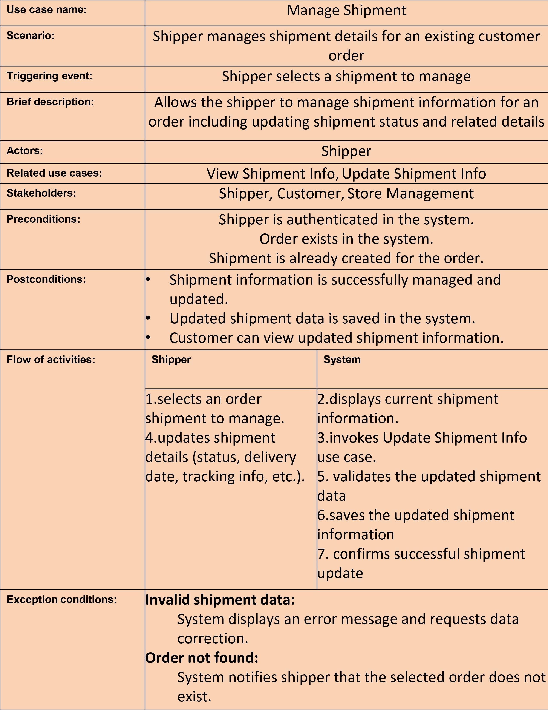

</details>

<details>
<summary><strong>Click to expand Data Flow Diagrams</strong></summary>


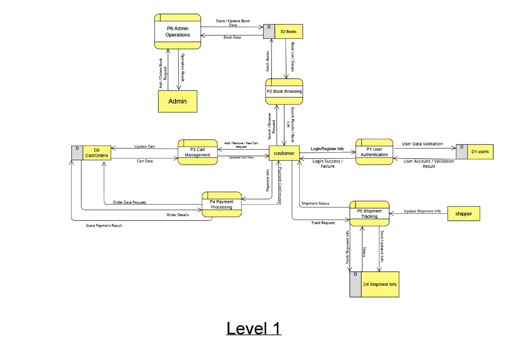

</details>

<details>
<summary><strong>Click to expand System Overview</strong></summary>

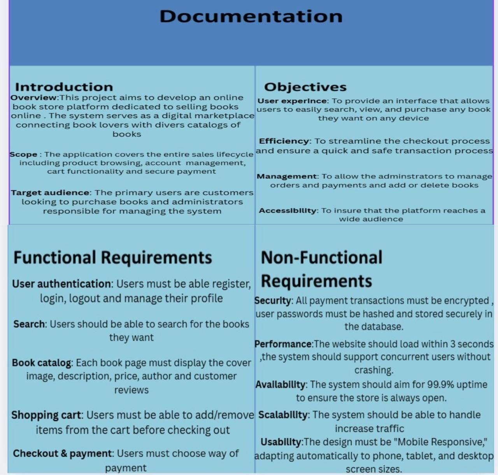

</details>

---

<div align="center">
  <sub>Last Updated: 2026-01-05</sub>
</div>

